# Total War Anthill - System Flow Diagram

## Complete Menu System & Mouse Filter Management Flow

```mermaid
graph TD
    Start([Project Starts]) --> MainReady[Main.gd _ready]
    MainReady --> LoadMainMenu[load_menu MainMenu.tscn]
    LoadMainMenu --> SetMenuStop[MenuLayer.mouse_filter = STOP]
    
    %% Main Menu Flow
    SetMenuStop --> MainMenuUI[Main Menu UI Displayed]
    MainMenuUI --> StartGame{User Clicks Start Game}
    StartGame --> LoadStrategic[load_game_scene StrategicMap.tscn]
    LoadStrategic --> ClearMenuLayer1[clear_menu_layer]
    ClearMenuLayer1 --> DeferIgnore1[call_deferred _set_menu_layer_ignore]
    DeferIgnore1 --> StrategicActive[Strategic Map Active & Clickable]
    
    %% Strategic Map Interactions
    StrategicActive --> ColonyClick{User Clicks Colony Button}
    StrategicActive --> EscPress{User Presses ESC}
    
    %% Colony Flow
    ColonyClick --> LoadColony[load_game_scene ColonyView.tscn]
    LoadColony --> ClearMenuLayer2[clear_menu_layer]
    ClearMenuLayer2 --> DeferIgnore2[call_deferred _set_menu_layer_ignore]
    DeferIgnore2 --> ColonyActive[Colony View Active & Clickable]
    ColonyActive --> BackClick{User Clicks Back}
    BackClick --> LoadStrategic
    
    %% ESC Menu Flow
    EscPress --> ShowGameMenu[show_game_menu]
    ShowGameMenu --> ClearMenuLayer3[clear_menu_layer]
    ClearMenuLayer3 --> LoadGameMenuScene[Load GameMenu.tscn]
    LoadGameMenuScene --> SetMenuStop2[MenuLayer.mouse_filter = STOP]
    SetMenuStop2 --> GameMenuOverlay[Game Menu Overlay - Game Blocked]
    
    %% Game Menu Options
    GameMenuOverlay --> ResumeClick{Resume Clicked}
    GameMenuOverlay --> SettingsClick{Settings Clicked}
    GameMenuOverlay --> MainMenuClick{Main Menu Clicked}
    
    %% Resume Flow
    ResumeClick --> GameMenuResume[game_menu.gd _on_resume_button_pressed]
    GameMenuResume --> CallClearMenu[main_scene_manager.clear_menu_layer]
    CallClearMenu --> ClearMenuLayer4[clear_menu_layer in Main.gd]
    ClearMenuLayer4 --> QueueFreeGameMenu[queue_free game menu]
    QueueFreeGameMenu --> DeferIgnore3[call_deferred _set_menu_layer_ignore]
    DeferIgnore3 --> BackToGame[Back to Game - Buttons Clickable]
    BackToGame --> StrategicActive
    
    %% Settings Flow
    SettingsClick --> ShowSettings[show_settings_menu]
    ShowSettings --> ClearMenuLayer5[clear_menu_layer]
    ClearMenuLayer5 --> LoadSettingsScene[Load SettingsMenu.tscn]
    LoadSettingsScene --> SetMenuStop3[MenuLayer.mouse_filter = STOP]
    SetMenuStop3 --> SettingsOverlay[Settings Menu Overlay]
    SettingsOverlay --> SettingsBack{Back Clicked}
    SettingsBack --> SettingsBackHandler[settings_menu.gd _on_back_button_pressed]
    SettingsBackHandler --> CheckInGame{is_in_game?}
    CheckInGame -->|Yes| ShowGameMenu
    CheckInGame -->|No| LoadMainMenu
    
    %% Main Menu Return
    MainMenuClick --> LoadMainMenu
    
    %% Styling
    classDef gameNode fill:#e1f5fe
    classDef menuNode fill:#f3e5f5
    classDef filterNode fill:#fff3e0
    classDef userAction fill:#e8f5e8
    
    class StrategicActive,ColonyActive,BackToGame gameNode
    class MainMenuUI,GameMenuOverlay,SettingsOverlay menuNode
    class SetMenuStop,SetMenuStop2,SetMenuStop3,DeferIgnore1,DeferIgnore2,DeferIgnore3 filterNode
    class StartGame,ColonyClick,EscPress,ResumeClick,SettingsClick,BackClick,MainMenuClick,SettingsBack userAction
```



## Mouse Filter State Management

```mermaid
stateDiagram-v2
    [*] --> MenuDisplayed : Menu Loaded
    MenuDisplayed : MenuLayer.mouse_filter = STOP
    MenuDisplayed : (Blocks game input)
    
    MenuDisplayed --> MenuClearing : clear_menu_layer() called
    MenuClearing : Nodes queued for deletion
    MenuClearing : mouse_filter change deferred
    
    MenuClearing --> GameActive : call_deferred executed
    GameActive : MenuLayer.mouse_filter = IGNORE
    GameActive : (Game input enabled)
    
    GameActive --> MenuDisplayed : Menu loaded again
    
    note right of MenuClearing : Critical timing fix:\nDefer filter change until\nnodes are actually freed
```

## Key Components Interaction

```mermaid
graph LR
    subgraph "Main.tscn Structure"
        MainNode[Main Node]
        GameLayer[GameLayer Node2D]
        MenuLayer[MenuLayer Control]
        MainNode --> GameLayer
        MainNode --> MenuLayer
    end
    
    subgraph "Scene Management"
        MainGD[Main.gd]
        GameScenes[Game Scenes<br/>StrategicMap<br/>ColonyView]
        MenuScenes[Menu Scenes<br/>MainMenu<br/>GameMenu<br/>SettingsMenu]
    end
    
    subgraph "Mouse Filter States"
        Stop[STOP = 0<br/>Blocks Input]
        Ignore[IGNORE = 2<br/>Passes Input]
    end
    
    MainGD --> GameLayer : Loads game scenes
    MainGD --> MenuLayer : Loads menu scenes
    MainGD --> Stop : When menu active
    MainGD --> Ignore : When game active
    
    GameScenes --> GameLayer
    MenuScenes --> MenuLayer
    
    style GameLayer fill:#e1f5fe
    style MenuLayer fill:#f3e5f5
    style Stop fill:#ffebee
    style Ignore fill:#e8f5e8
```

## Critical Fix Points

### 1. **Initial Problem**: Empty MenuLayer Blocking Input
```
MenuLayer (Control) - Always above GameLayer
├── mouse_filter = STOP (default)
└── Blocks ALL input to GameLayer below
    └── Even when MenuLayer is empty!
```

### 2. **Mouse Filter Solution**: Dynamic State Management
```
Menu Loading:     mouse_filter = STOP   (Block game input)
Menu Clearing:    mouse_filter = IGNORE (Allow game input)
Deferred Timing:  call_deferred()       (Wait for queue_free)
```

### 3. **Resume Button Fix**: Proper Cleanup Chain
```
Old Flow:  Resume → queue_free()        → Input stays blocked
New Flow:  Resume → clear_menu_layer()  → Proper input restoration
```

## Scene Hierarchy & Z-Order

```
Main (Root Node)
├── GameLayer (Node2D) ← Z-Index: 0 (Below)
│   ├── StrategicMap
│   └── ColonyView
└── MenuLayer (Control) ← Z-Index: 1 (Above)
    ├── MainMenu
    ├── GameMenu (Overlay)
    └── SettingsMenu
```

**Key**: MenuLayer is always visually above GameLayer, but input blocking is controlled by `mouse_filter` property, not Z-order.

---

## Summary

This system ensures:
- ✅ **Proper Layer Management**: Game and Menu layers are clearly separated
- ✅ **Dynamic Input Control**: Mouse filter changes based on active state  
- ✅ **Timing Safety**: Deferred mouse filter updates prevent conflicts
- ✅ **Clean Transitions**: All menu operations go through Main.gd centrally
- ✅ **Resume Functionality**: Proper cleanup when returning from menus

The critical insight was that **visual layering (Z-order) ≠ input blocking**. Input blocking is controlled by the `mouse_filter` property, which needed dynamic management synchronized with scene loading/clearing operations.
